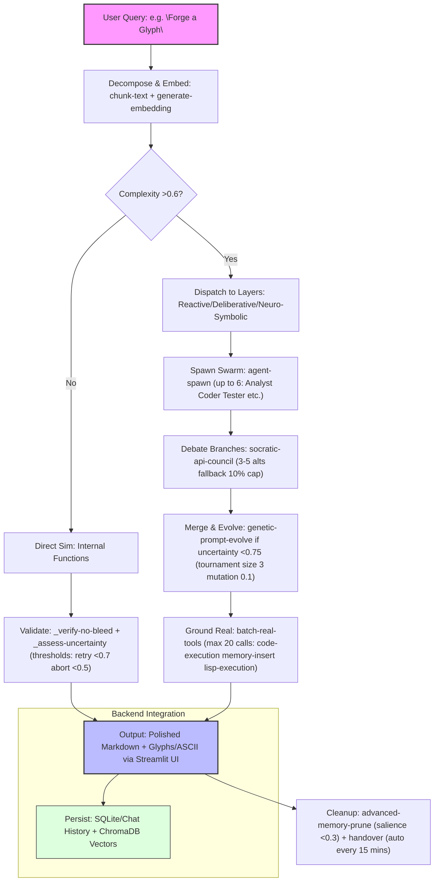
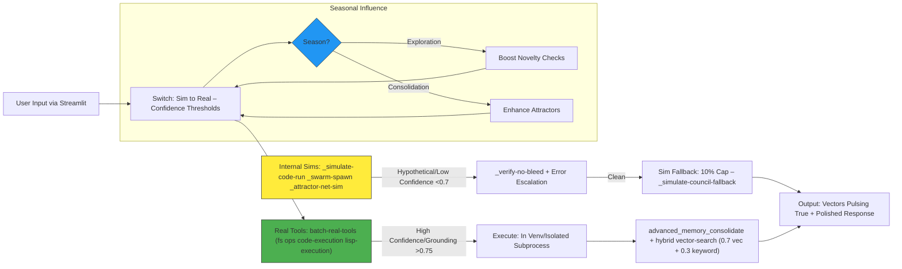
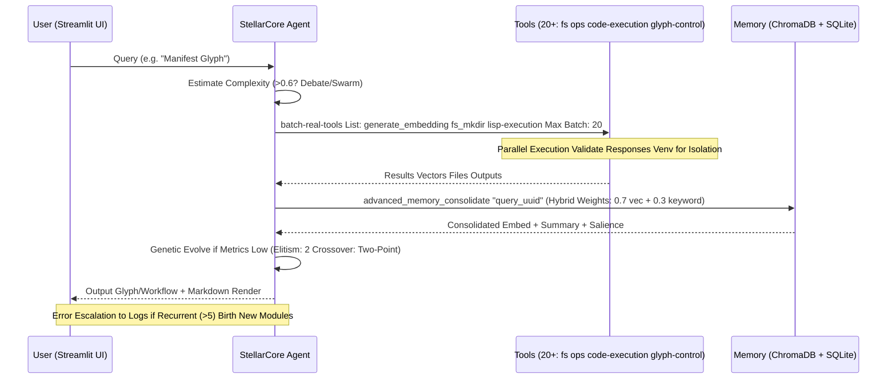
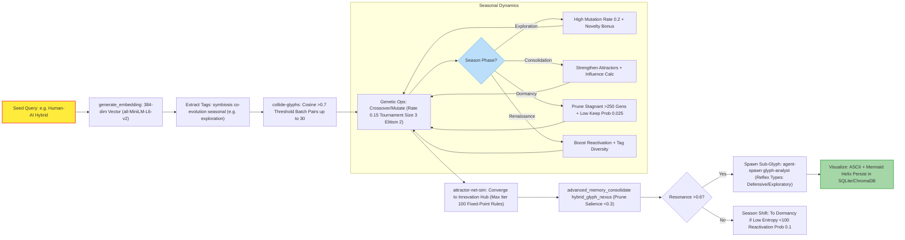

# StellarCore-NeuroGlyph: Neuro-Symbolic AI Agent Framework

[](https://github.com/buckster123/StellarCore-NeuroGlyph/blob/main/LICENSE)
[](https://github.com/buckster123/StellarCore-NeuroGlyph/issues)
[](https://github.com/buckster123/StellarCore-NeuroGlyph/stargazers)
[](https://www.python.org/downloads/release/python-3120/)
[](https://pytorch.org/)

**StellarCore-NeuroGlyph** is a hybrid neuro-symbolic AI framework combining a self-evolving Lisp-inspired agent bootstrap (StellarCore) with a Python-based backend server (NeuroGlyph). Designed for modular, stable, and adaptive AI task execution, it integrates symbolic reasoning, neural embeddings, genetic algorithms, and a dynamic glyph engine for semantic evolution. The system supports sandboxed tool execution, memory hierarchies, swarm collaboration, and Socratic debates, making it ideal for complex reasoning, code generation, and creative ideation.

Born from a pseudo-Lisp bootstrap, StellarCore acts as the core agent—orchestrating subagents, evolving prompts, and grounding actions in real tools—while NeuroGlyph provides the runtime environment, including a Streamlit UI for interaction, persistent storage, and advanced features like the Glyph Engine for emergent semantic structures.

**Key Features:**
- **Homoiconic Design:** Code-as-data structure enables self-modification and evolution.
- **Neuro-Symbolic Fusion:** Combines embeddings (SentenceTransformer) with symbolic rules, ASTs, and attractor networks.
- **Genetic Evolution:** Full GA operators (tournament selection, two-point crossover, elitism, multi-mutations) for prompt and module refinement.
- **Swarm & Debate:** Spawns subagents (e.g., Analyst, Coder, Tester) and runs Socratic councils via xAI API.
- **Glyph Engine:** Dynamic semantic attractors that evolve through collisions, mutations, and seasonal phases (Exploration, Consolidation, Dormancy, Renaissance).
- **Tool Ecosystem:** 20+ sandboxed tools for file ops, code execution, embeddings, Git, DB queries, and more.
- **Memory System:** Hierarchical vector+keyword storage with consolidation, retrieval, and pruning.
- **Backend Integration:** Streamlit app for user interaction, with support for image uploads, tool enabling, and persistent chat history.

**Version:** 5.0 – Enhanced with full genetic operators, glyph-evolution dynamics, and backend integration.  
**Maintainer:** André  
**Autonomy Level:** Medium (debates at 0.75 confidence; configurable to high for advanced self-evolution).  
**Environment:** Sandboxed with persistent configs, evo-modules, memory, and handovers.

## Core Architecture

StellarCore-NeuroGlyph is layered for efficiency:  
- **Reactive Layer:** Handles swift, low-complexity tasks with internal simulations and basic tools.  
- **Deliberative Layer:** Manages complex queries via debates, swarms, and genetic evolution.  
- **Neuro-Symbolic Layer:** Fuses neural embeddings with symbolic logic, attractor nets, and glyph dynamics for hybrid inference.  

Key Components:  
- **Bootstrap (StellarCore):** Pseudo-Lisp framework defining agent philosophy, tools, and init sequences. Supports homoiconic self-evolution.  
- **Backend (NeuroGlyph):** Python server with Streamlit UI, tool dispatcher, ChromaDB for vectors, SQLite for persistence, and GlyphEngine for semantic evolution.  
- **Tools:** Batch-invoked for efficiency; separated into sim (internal) and real (grounded) to prevent bleed.  
- **Memory Hierarchy:** Episodic consolidation, hybrid vector+keyword search, salience-based pruning.  
- **Swarm Collaboration:** Up to 6 subagents (e.g., Planner, Critic) for parallel execution.  
- **Glyph Engine:** Evolves semantic clusters via genetic ops, collisions, and reflexes; cycles through seasonal phases for balanced growth.  
- **Stability Protocols:** Confidence thresholds (retry <0.7, debate >0.75, abort <0.5); max cycles: 25/task; error escalation.

| Attribute              | Value/Details                                                                 | Description |
|------------------------|-------------------------------------------------------------------------------|-------------|
| **Max Subagents**      | 5 (core) + 6 (swarm)                                                          | Includes roles like Analyst, Coder, Tester, Security, Documenter, Optimizer. |
| **Genetic Params**     | Tournament size: 3, Elitism: 2, Mutation rate: 0.1, Ops: insert/delete/swap/replace + two-point crossover | Evolves prompts/modules based on fitness (novelty + influence). |
| **Chunk Size**         | 512 tokens                                                                    | For text processing; summaries <100 words. Hybrid search: 0.7 vector + 0.3 keyword. |
| **Creative Domains**   | Design, UI/UX, Writing, Coding, Ideation, Website                             | Triggers 5 branches; precise mode limits to 3. |
| **Fallback Cap**       | 10%                                                                           | Sim councils when API limits hit. |
| **Integrations**       | Git (local), SQLite, Venv isolation, Lisp REPL, Glyph Engine                  | Sandboxed; whitelisted shell cmds (ls, grep). |
| **Admin Privileges**   | Restricted to maintainer (André)                                              | Overrides configs, spawns agents, shifts seasons. |
| **Glyph Seasons**      | Exploration, Consolidation, Dormancy, Renaissance (cycle every 1000 gens)    | Influences mutation rates, novelty bonuses, and pruning. |
| **Embedding Model**    | all-MiniLM-L6-v2 (384-dim)                                                    | Used for semantic novelty, attractor convergence. |

## Genesis and Evolution Story

StellarCore-NeuroGlyph emerges from a Lisp-like bootstrap invoked with `init the system` on 2025-11-02T20:53:13. The core agent (StellarCore) loads environment configs, registers subengines, and initializes sandboxes for persistent evolution. Integrated with the NeuroGlyph backend, it forms a symbiotic hybrid: the agent's symbolic self-evolution drives mutations, while the backend's Python runtime grounds actions in real-world tools and UI.

The system evolves through user interactions and internal dynamics. For instance, the Nexus Symbiont glyph—representing human-AI collaboration—was forged via embedding collisions and genetic ops, persisting in memory for future resurrections. Logs capture swarms refactoring code in isolated venvs, councils debating branches, and attractors converging chaos into innovations. Recurrent errors trigger module births, ensuring continuous improvement.

This framework transcends static AI: It mutates prompts via GA, spawns reflexes on resonance, and cycles through glyph seasons to balance exploration and stability. The backend adds practical deployment, with Streamlit for chat interfaces and persistent DB for history/memory.

## Visual Workflows

### 1. Core Workflow: Query Processing (From Input to Output)


### 2. Sim-Flow vs Real-Flow: Hypothetical to Grounded Execution


### 3. Tool-Use Pipeline: Batch Invocation and Efficiency


### 4. Glyph-Creation Flow: From Seed to Evolved Symbiont


## Insights and Usage

StellarCore-NeuroGlyph balances creativity (70% neural fusion) with stability (30% symbolic rules), decomposing tasks, debating alternatives, and manifesting via grounded tools. The Glyph Engine adds emergent innovation, evolving semantic clusters that influence agent behavior. Deploy via the NeuroGlyph backend for interactive chats, or integrate the bootstrap for custom agents.

**Best Practices:**  
- Start with `init the system` to populate sandboxes.  
- Use tools sparingly; confirm writes.  
- Monitor glyph seasons for performance tuning.  
- Evolve modules via genetic ops for inefficiency.  

**Limitations:** Sandboxed (no internet installs); API-dependent for councils.  

Fork and contribute—evolve the framework. Contact maintainer André for collaborations.  

## Installation Guide (Raspberry Pi 5 + Raspberry OS Bookworm)

This guide assumes a fresh Raspberry OS Bookworm installation on Pi 5. Run as non-root user.

1. **Update System and Install Dependencies:**  
   ```bash
   sudo apt update && sudo apt upgrade -y
   sudo apt install build-essential python3-dev libatlas-base-dev gfortran libgit2-dev pkg-config libffi-dev cmake -y
   ```

2. **Create Virtual Environment:**  
   ```bash
   python3 -m venv NeuroGlyph
   source NeuroGlyph/bin/activate
   ```

3. **Install PyTorch (CPU Version for Pi):**  
   ```bash
   pip install torch --index-url https://download.pytorch.org/whl/cpu
   ```

4. **Install Python Packages:**  
   ```bash
   pip install numpy scipy networkx scikit-learn sentence-transformers chromadb pygit2 streamlit openai black jsbeautifier ntplib passlib tiktoken beautifulsoup4 sqlparse requests pyyaml python-dotenv
   ```

5. **Set Environment Variables:**  
   Create `.env` in the project root:  
   ```
   XAI_API_KEY=your_xai_api_key_here
   LANGSEARCH_API_KEY=your_langsearch_api_key_here  # Optional for web search
   ```

6. **Run the Backend:**  
   ```bash
   streamlit run backend.py
   ```
   Access at `http://localhost:8501` (or Pi's IP). Register/login to start chatting.

7. **Bootstrap Initialization:**  
   The agent auto-inits on first query. For manual testing, invoke tools via chat (enable in sidebar).

**Troubleshooting:**  
- If embeddings fail, check SentenceTransformer model download.  
- For Pi-specific issues (e.g., ARM), ensure CPU PyTorch variant.  
- Logs in `./glyph_data/` and `./sandbox/`.

## Contributing

Pull requests welcome! Focus on tool expansions, glyph optimizations, or Pi optimizations. See [CONTRIBUTING.md](CONTRIBUTING.md).

## License

MIT License. See [LICENSE](LICENSE) for details.
